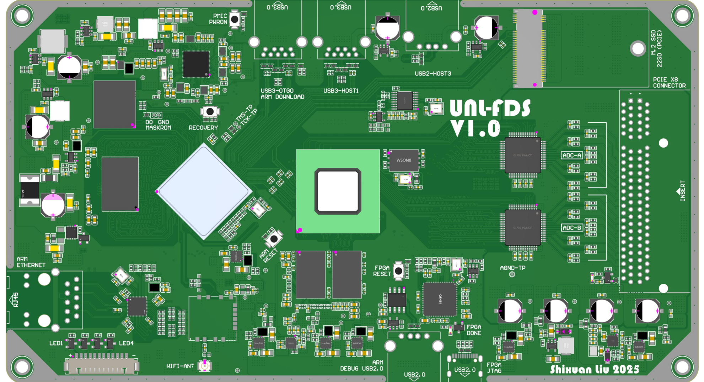
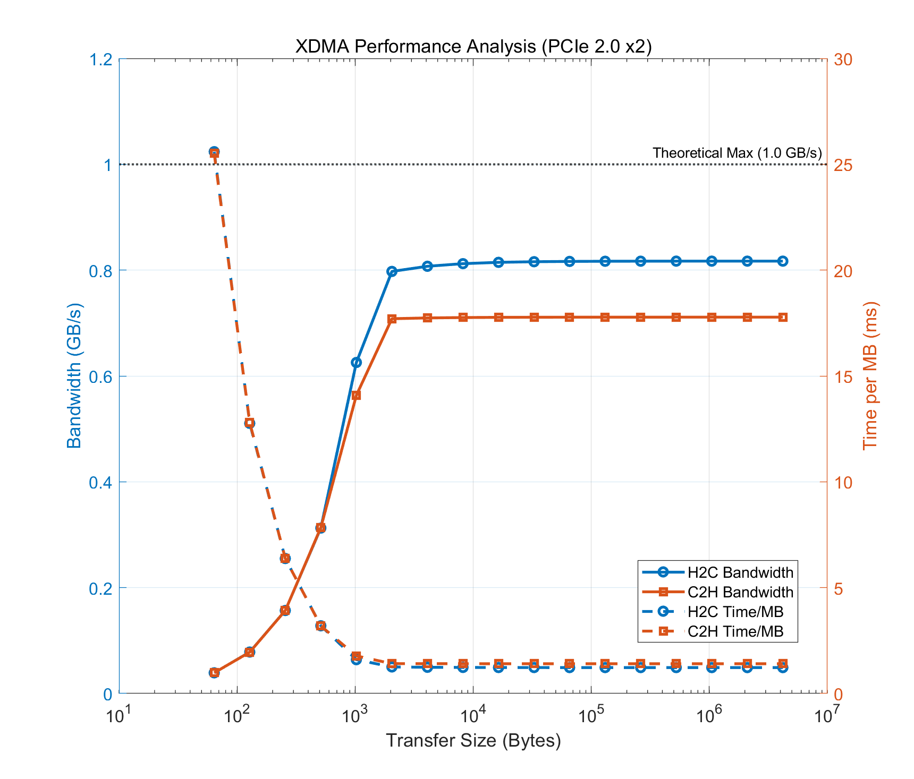

# VUPRS - 声学高速数据处理板

  

## 1. 硬件相关资源

本仓库是车下异响故障识别与定位系统 `(Vehicle-Under Fault Positioning and Recognition System, VUPRS)` 的硬件研发仓库, 主要用于管理相关依赖, 并整理代码.  

### 1.1 硬件模块

**主要芯片型号**

| 芯片 | 型号 | 说明 |
| :--- | :--- | :--- |
| 主控芯片 | `RK3568` | `2024` 年生产, `C` 版芯片 |
| FPGA | `XC7A100T-2FGG484` | —— |
| ADC | `AD760BSTZ` | 最大采样频率 `200 kHz` |
| 无线连接 | `6223E-UUD` | 内部为 `RTL8723DU`, `2.4GHz` |

**主要存储芯片型号**:

| 存储器名称 | 型号 | 存储器类型与容量 |
| :--- | :--- | :--- |
| `RK3568` 外挂 `SDRAM` | `K4U6E3S4AA-MGCL` | `LPDDR4X`, `16 GB` |
| `RK3568` 外挂 `eMMC` | `KLMBG2JETD-B041` | `eMMC Flash`, `32 GB` |
| `FPGA` 外挂 `SDRAM` | `NT5CC128M16IP-DI` | `DDR3L`, `2GB` |
| `FPGA` 固化配置 `Flash` | `W25Q128JVEQ` |  `SPI Flash`, `128 MB` |

### 1.2 通信接口

| 接口类型 | 控制主机 | 说明 |
| :--- | :--- | :--- |
| `USB3.0` | `RK3568` | 有 `USB3-OTG0` 和 `USB3-HOST1` `2` 个接口引出 |
| `USB2.0` | `RK3568` | 只有 `USB2-HOST3` 引出 |
| `M.2 NVMe SSD (PCIe 2.0 Lane 1, 2230)` | `RK3568` | 支持 `2230` `PCIe` 接口 `SSD` 内存条 |
| `Ethernet IEEE 802.3ab` | `RK3568` | 千兆 `RJ45` 接口以太网 |
| `PCIe 3.0 Lane 2` | `RK3568` & `FPGA` | 由于 `FPGA` 侧只支持 `PCIe 2.0`, 因此此通信接口降速到 `PCIe 2.0` 标准, 理论最大带宽 `1 GB/s` |

### 1.3 调试接口

| 接口类型 | 控制主机 | 说明 |
| :--- | :--- | :--- |
| `USB2.0 Debug UART` | `RK3568` | 在 `RK3568` 的所有启动阶段, 这个接口的波特率均为 `115200 Baud` |
| `TYPE-C 3.1 JTAG` | `FPGA` | 用于 `VIVADO` 调试 `FPGA` 设备, 使用的是 `USB` 转 `JTAG` 方案 |

### 1.4 `ADC` 模拟信号输入接口

板子的模拟信号通过最右侧 `PCIe x8` 接口输入, 这里 `PCIe` 接口只是当作排线使用.  
这个 `PCIe x8` 接口共有 `2` 列, 每列 `49` 个引脚, 硬件设计时每一行的 `2` 个引脚都是短接在一起的, 这些引脚从上到下对应的连接如下:  

| 引脚编号 | 接口信号名称 | 电流方向 | 说明 |
| :---: | :--- | :---: | :--- |
| `A1`-`B1` | `AGND` | --- | 模拟信号地 |
| `A2`-`B2` | `+12V VCCA` | `O` | 模拟电源 `+12V` |
| `A3`-`B3` | `+12V VCCA` | `O` | 模拟电源 `+12V` |
| `A4`-`B4` | `AGND` | --- | 模拟信号地 |
| `A5`-`B5` | `AGND` | --- | 模拟信号地 |
| `A6`-`B6` | `-12V VCCA` | `O` | 模拟电源 `-12V` |
| `A7`-`B7` | `-12V VCCA` | `O` | 模拟电源 `-12V` |
| `A8`-`B8` | `AGND` | --- | 模拟信号地 |
| `A9`-`B9` | `AGND` | --- | 模拟信号地 |
| `A10`-`B10` | `+2V VCCA` | `O` | 模拟电源 `+2V` |
| `A11`-`B11` | `+2V VCCA` | `O` | 模拟电源 `+2V` |
| --- | --- | --- | `PCIe` 机械槽 |
| --- | --- | --- | `PCIe` 机械槽 |
| --- | --- | --- | `PCIe` 机械槽 |
| `A12`-`B12` | `AGND` | --- | 模拟信号地 |
| `A13`-`B13` | `AGND` | --- | 模拟信号地 |
| `A14`-`B14` | `ADC-A channel 8` | `I` | `ADC-A` 通道 `8` |
| `A15`-`B15` | `AGND` | --- | 模拟信号地 |
| `A16`-`B16` | `ADC-A channel 7` | `I` | `ADC-A` 通道 `7` |
| `A17`-`B17` | `AGND` | --- | 模拟信号地 |
| `A18`-`B18` | `ADC-A channel 6` | `I` | `ADC-A` 通道 `6` |
| `A19`-`B19` | `AGND` | --- | 模拟信号地 |
| `A20`-`B20` | `ADC-A channel 5` | `I` | `ADC-A` 通道 `5` |
| `A21`-`B21` | `AGND` | --- | 模拟信号地 |
| `A22`-`B22` | `ADC-A channel 4` | `I` | `ADC-A` 通道 `4` |
| `A23`-`B23` | `AGND` | --- | 模拟信号地 |
| `A24`-`B24` | `ADC-A channel 3` | `I` | `ADC-A` 通道 `3` |
| `A25`-`B25` | `AGND` | --- | 模拟信号地 |
| `A26`-`B26` | `ADC-A channel 2` | `I` | `ADC-A` 通道 `2` |
| `A27`-`B27` | `AGND` | --- | 模拟信号地 |
| `A28`-`B28` | `ADC-A channel 1` | `I` | `ADC-A` 通道 `1` |
| `A29`-`B29` | `AGND` | --- | 模拟信号地 |
| `A30`-`B30` | `AGND` | --- | 模拟信号地 |
| `A31`-`B31` | `ADC-B channel 8` | `I` | `ADC-B` 通道 `8` |
| `A32`-`B32` | `AGND` | --- | 模拟信号地 |
| `A33`-`B33` | `ADC-B channel 7` | `I` | `ADC-B` 通道 `7` |
| `A34`-`B34` | `AGND` | --- | 模拟信号地 |
| `A35`-`B35` | `ADC-B channel 6` | `I` | `ADC-B` 通道 `6` |
| `A36`-`B36` | `AGND` | --- | 模拟信号地 |
| `A37`-`B37` | `ADC-B channel 5` | `I` | `ADC-B` 通道 `5` |
| `A38`-`B38` | `AGND` | --- | 模拟信号地 |
| `A39`-`B39` | `ADC-B channel 4` | `I` | `ADC-B` 通道 `4` |
| `A40`-`B40` | `AGND` | --- | 模拟信号地 |
| `A41`-`B41` | `ADC-B channel 3` | `I` | `ADC-B` 通道 `3` |
| `A42`-`B42` | `AGND` | --- | 模拟信号地 |
| `A43`-`B43` | `ADC-B channel 2` | `I` | `ADC-B` 通道 `2` |
| `A44`-`B44` | `AGND` | --- | 模拟信号地 |
| `A45`-`B45` | `ADC-B channel 1` | `I` | `ADC-B` 通道 `1` |
| `A46`-`B46` | `AGND` | --- | 模拟信号地 |
| `A47`-`B47` | `AGND` | --- | 模拟信号地 |
| `A48`-`B48` | `DGND` | --- | 数字信号地, 不可用于模拟系统 |
| `A49`-`B49` | `Card PRSNT#` | `I` | 麦克风阵列插入检测引脚, 低电平有效 |
 
**接口注意事项**  

1. `A49`-`B49` 是麦克风阵列插入检测引脚, 当麦克风阵列信号插入 `PCIe` 接口时, 该引脚会被拉低, 表示 "已经插入", 同时板子上靠近接口的白色 `LED` 会点亮.  
2. 为了实现插入检测功能, 麦克风阵列板端需要短接 `A48`-`B48` 和 `A49`-`B49`.  
3. 在任何情况下都不要将 `A48`-`B48` 的 `DGND` 用于模拟系统, 这会破坏模拟信号的单点接地结构, 因此, 麦克风阵列板上只能使用 `AGND` 作为地.  
4. 此接口输出的 `3` 个电源纹波约为 `30mV`, 纹波主频范围为 `40 kHz - 2.5 MHz`, 当 `ADC` 输入信号范围为 `+/- 10 V` 时, 每 `bit` 量化电压为 `0.3 mV`. 因此强烈建议在麦克风阵列板上对这 `3` 个电源进行滤波, 在这个频率范围内放置 `PSRR >= 40 dB` 的多级 `LC` 滤波网络.  

## 2. `RK3568` 侧使用手册

除了烧录固件, `RK3568` 的操作均在串口终端实现, 请使用 `MobaXterm` 并正确设置并连接串口.  

### 2.1 烧录固件或更新 `Loader`

**Step 1**: 给板子断电;  
**Step 2**: 使用 `USB` 线连接板子的 `USB3-OTG0` 和主机任意 `USB` 口;  
**Step 3**: 打开 `Rockchip` 烧录工具;  
**Step 4**: 按住板子上的 `Recovery` 按钮, 在该按钮不松开的情况下, 给板子上电;  
**Step 5**: 当烧录工具提示发现一个 `Loader` 设备时, 松开 `Recovery` 按钮, 即可选择烧录 `image`, `boot`, `rootfs`, `U-Boot` 等镜像.  

### 2.2 修改 `DDR` 最高频率

在 `SDK` 整体编译前, 需要修改芯片设备树, 将原始的最高频率修改为新的最高频率, 这些频率取值不能随意选取, 必须和 `rkbin/bin` 中的几个描述文件对应.  
然后, 在 `rkbin/RKBOOT//RK3568MINIALL.ini` 中将 `Path1` 和 `FlashData` 指向的 `rkbin/bin` 下的对应 `bin` 文件.  

### 2.3 `DDR` 眼图测试

`U-Boot` 中集成了 `Rockchip` 眼图测试工具, 在正确烧录固件后, 请按照以下方式使用这个工具:  
  
**Step 1**: 板子进系统后, 按住键盘 `Ctrl+C` 组合键不放, 然后按下板子上的 `ARM-RESET` 按键, 此时板子会重启, 等待板子重启并停留在 `U-Boot` 界面, 当板子打印 `<INTERRUPT>` 时松开 `Ctrl+C` 组合键, 此时板子已经停留在 `U-Boot`;  
**Step 2**: 在 `U-Boot` 中, 运行 `ddr_dq_eye` 指令, 此时 `RK3568` 会在 `DDR` 的最高频率下测试信号眼图, 并输出结果.  
  
当前 `DDR` 眼图测试结果如下:  

| `DDR` 频率 | 最小读取眼宽 | 最小写入眼宽 | 此频率下 `Rockchip` 官方规定的最小眼宽 |
| :--- | :---: | :---: | :---|
| `1560 MHz` | `52` | `48` | Limitation:  `25` - read, `24` - write |
| `920 MHz` | `71` | `56` | Limitation:  `30` - read, `29` - write |

### 2.4 `PCIe` 接口测试

与 `FPGA` 通信的 `PCIe` 接口使用的是 `Xilinx XDMA`, 截止到 `2025` 年 `8` 月, `XDMA` 的驱动仍然只支持 `x86-64 bit` 架构的 `CPU`, 因此官方驱动不能直接用于本项目.  
为了在 `RK3568` 上使用 `XDMA`, 这里使用了有关开发者修改后的 `XDMA` 驱动, 其中主要修改了 `long` 等数据类型并增加了一些程序补丁, 使该驱动在 `ARM` 架构下读写与 `x86` 架构下读写结果相同. 驱动来源:  

    https://github.com/laurencebarker/Saturn.git

进入 `linuxdriver` 目录即可看到驱动源码.  
拿到驱动后, 在虚拟机下修改 `tools/Makefile` 和 `xdma/Makefile`, 指定 `Linux` 内核源码路径和架构, 交叉编译器等即可 `make` 编译.  
将编译好的驱动拉到板子里, 运行 `tests/.load_driver.sh` 挂载驱动 (请确认 `RK3568` 的设备树中已经开启了 `pcie3x2` 控制器), 然后运行 `tests/.run_test.sh` 测试读写, 运行 `tests/.perform_hwcount.sh` 可以测试读写速度.  
当前 `PCIe` 接口的实测最高读写速度如下 (向下取整):  
  
    Host to Card (H2C): 810 MB/s
    Card to Host (C2H): 710 MB/s
  
读写速度与传输字节数对应关系如下图所示:  
  
该接口理论最大带宽为 `1 GB/s`.  

### 2.5 千兆以太网测速

请按照以下方式对千兆以太网进行测试.  
  
**Step 1**: 用网线连接板子和主机, 注意网线至少选择 `CAT6` 及以上标准的;  
**Step 2**: 通过 `ipconfig` 和 `ifconfig` 分别检查主机和板子的 `IP` 地址. 注意两个设备的网段必须相同, 如果不同请通过以下命令修改板子的 `IP` 地址配置:  

    ifconfig eth0 <IP address> netmask <net mask> up

例如:  

    ifconfig eth0 192.168.1.100 netmask 255.255.0.0 up

完成后验证板子和主机是否可以 `ping` 通, 如果主机与板子在同一子网但是无法 `ping` 通, 可以检查主机防火墙等设置.  
**Step 3**: 在主机侧打开监听程序:  

    iperf3 -s

**Step 4**: 在板子侧运行测试应用程序:  

    iperf3 -c <master IP> -t <total time> -i <info time>

例如:  

    iperf3 -c 192.168.1.200 -t 600 -i 10

代表测试 `600` 秒, 每隔 `10` 秒打印一次测试结果.  
当前以太网接口的实测读写速度如下:  

    Slave to Master: 700 MB/s
    Master to Slave: 300 MB/s

### 6. 连接 `WIFI`

板子搭载了一个 `RTL8723DU` 模块, 硬件上只连接了 `WIFI` 端口, 请按照以下步骤连接 `WIFI`:  
  
**Step 1**: 确认板子的 `WIFI` 天线是否连接, 如果没有连接天线, 需要使用 `2.4G`, `IPEX-1` 规格的天线连接到板子上的 `WIFI-ANT`;  
**Step 2**: 在系统中使用如下命令扫描存在的 `WIFI`:  

    nmcli dev wifi list

**Step 3**: 通过以下命令连接存在的 `WIFI`:  

    nmcli dev wifi connect <SSID> password <password>

例如:  

    nmcli dev wifi connect ChinaNet-c6vw password 3141592653

这个 `WIFI` 很慢, 主要用来拉取代码.

**断开 `WIFI`**:

    nmcli dev disconnect wlan0

## 3. `FPGA` 侧使用手册

### 3.1 通过 `VIVADO` 连接 `FPGA`

使用 `TYPE-C` 转 `USB` 线连接板子的 `TYPE-C FPGA JTAG` 口和主机任意 `USB` 口, `VIVADO` 即可识别设备.  
板子使用的是 `FT2232` 的 `USB-JTAG` 方案, 因此在使用前需要配置 `FT2232` 的 `EEPROM`, 请使用本仓库中 `FPGA\Tools` 下的工具进行配置.  

### 3.2 `FPGA` 开发通用流程

`FPGA` 的硬件设计流程和其他所有厂家的相同, 只需在 `VIVADO` 中进行即可.  

_Shixuan Liu 2025_