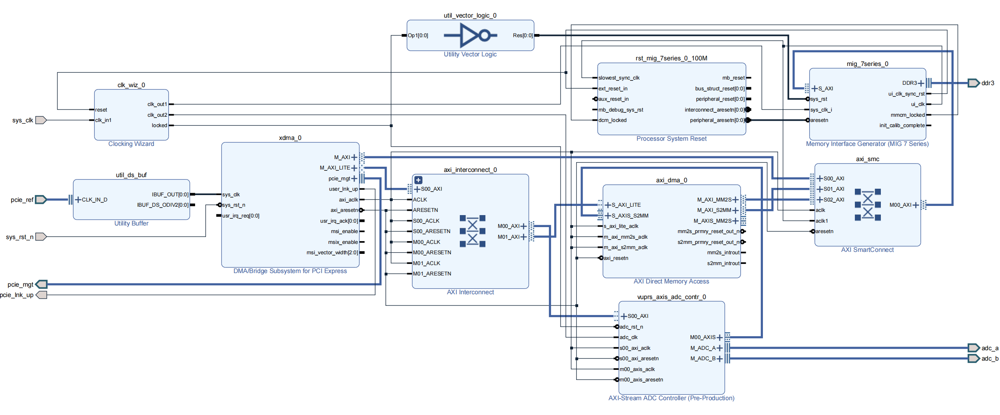
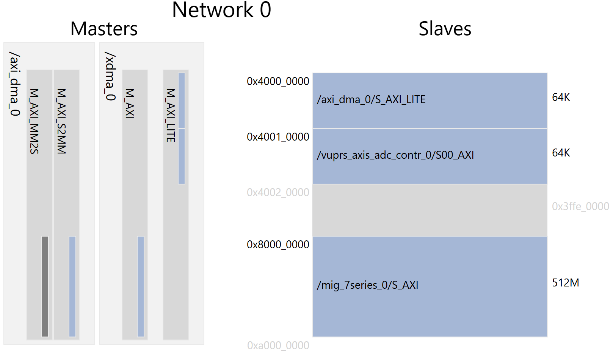

# User Guide

本文档是高速数据采集板编程指南, 记录了所有编程调试步骤.  

## 1. `FPGA` 系统设计

`FPGA` 使用 `PCIe` 接口和 `RK3568` 通信.  
具体的, `FPGA` 通过 `XDMA IP` 将 `PCIe` 事务映射到 `FPGA` 侧 `AXI-Full` 和 `AXI-Lite` 总线.  

    AXI-Full 总线负责 DDR3 的读写, 是主要数据通道  
    AXI-Lite 总线负责配置 ADC 采集控制模块和 DMA 控制模块  

系统可以完成定频/定帧采样.  

### 1.1 `FPGA` 侧 `Block Design`

按照系统实际需求, `FPGA` 系统框图设计如下, 当前提交的设计已经达到时序收敛.  
  
  
  
### 1.2 `FPGA` 侧 `AXI` 总线地址分配

主机通过 `PCIe` 接口访问 `FPGA` 侧 `AXI-Full` 和 `AXI-Lite` 总线.  
`AXI-Full` 总线可以访问 `DDR3` 的全部数据 (`512 M`); `AXI-Lite` 主要用于控制 `FPGA` 侧的采集和数据传递过程, 可以访问相关寄存器.  
`AXI-Lite` (`BAR` 地址为 `0x4000_0000`) 总线可以访问所有配置寄存器.  
  
`AXI` 总线 (包括 `AXI-Full` 和 `AXI-Lite`) 的有效地址范围为 `0x4000_000 - 0xA000_0000`, 这个范围中每一段地址分配如下:  

| 起始地址 | 结束地址 | 大小 | 用途 |
| :---: | :---: | :---: | :--- |
| `0x0000_0000` | `0x3FFF_FFFF` | `-` | `Reserved` |
| `0x4000_0000` | `0x4000_FFFF` | `64 k` | `DMA` 模块控制器地址范围 |
| `0x4001_0000` | `0x4001_FFFF` | `64 k` | `ADC` 模块控制器地址范围 |
| `0x4002_0000` | `0x7FFF_FFFF` | `-` | `Reserved` |
| `0x8000_0000` | `0x9FFF_FFFF` | `512 M` | `DDR3` 地址范围,  `ADC` 采样数据从该地址处读取 |
  
  

### 1.3 通过 `AXI` 总线控制 `FPGA` 完成采集

主机通过 `AXI-Lite` 配置 `DMA` 和 `ADC` 完成数据采集与转移操作, 然后通过 `AXI-Full` 总线将数据从 `FPGA` 侧 `DDR` 转移到 `RK3568` 中.  
正确配置 `DMA` 和 `ADC` 控制寄存器即可完成采集.  
  
#### 1.3.1 `DMA` 控制器配置说明
  
请参考 `Xilinx` 官方文档 `PG021 AXI DMA`, 将 `DMA` 指向 `DDR` 的起始地址并开启 `DMA`.  
  
#### 1.3.2 `ADC` 控制器配置说明
  
 `ADC` 控制器中有 `6` 个控制与状态寄存器, 这些寄存器的信息如下表所示.  
  
| `Address` | `Name` | `R/W` | `Description` |
| :--- | :--- | :--- | :--- |
| `0x00` | `SCI` | `R/W` | `Sampling Clock Increment` |
| `0x04` | `SP` | `R/W` | `Sampling Points` |
| `0x08` | `SF` | `R/W` | `Sampling Frames` |
| `0x0C` | `STR` | `R/W` | `Sampling Trigger & Ready` |
| `0x10` | `NGF` | `R` | `Number of Generated Frames` |
| `0x14` | `ERR` | `R` | `Error Flags of ADC` |
  
**寄存器详细信息**  
  
**`SCI (Sampling Clock Increment, offset = 00h)`**  
  
`ADC` 工作时钟通过外部高精度晶振输入, 在 `FPGA` 中被锁定为 `100 MHz`. `ADC` 采样触发时钟通过工作时钟分频得到, 该寄存器即设置分频系数, 采样频率 $f_{sampling}$ 和 周期 $T_{sampling}$ 与寄存器 `SCI` 取值的关系为:  
  
$$f_{sampling} = \frac{100 \times 10 ^ 6}{2 \times SCI}\ (Hz)$$
$$T_{sampling} = 20 \times SCI\ (ns)$$
  
**`SP (Sampling Points, offset = 04h)`**  
  
该寄存器的值是 `ADC` 在每一帧中的采样点数, 为了便于傅里叶变换等应用, 建议将该值设置为 `2` 的指数幂.  
  
**`SF (Sampling Frames, offset = 08h)`**  
  
该寄存器的值是 `ADC` 的采样帧数目. 结合 `SP` 寄存器的值, 总采样点数 $N_{sampling}$ 通过下式计算:  
$$ N_{sampling} = SP \times SF\ (points)$$
每个采样点都会产生 `16` 个通道的 `16` 位 `ADC` 数据, 因此 $N_{sampling}$ 对应的数据字节数 $C_{sampling}$ 为:  
$$ C_{sampling} = 32 \times N_{total}\ (bytes)$$
请确保 `FPGA` 侧的 `DDR` 空间足够, 即:  
$$ C_{sampling} \leq 512 MB $$
  
**`STR (Sampling Trigger & Ready, offset = 0Ch)`**  
  
**对该寄存器的任何写操作都会触发采样** (这些写操作不会实际作用于寄存器, 但是会被内部触发器捕捉从而触发采样).  
同时该寄存器的 `0` 位用于显示上一个任务是否完成:  

**STR寄存器**
| Bits | Name | Description |
| :---: | :---: | :--- |
| `0` | `RDY` | `0` = 上一次采样正在进行中, 新的配置数据不能写入;  `1` = 上一次采样结束, 可以写入新数据并触发新一轮采样; |
| `[31: 1]` | - | Reserved |
  
**`NGF (Number of Generated Frames, offset = 10h)`**  
  
该寄存器的值表明当前采样帧数, 可以用于监控采样进度.  
  
**`ERR (Error Flags of ADC, offset = 14h)`**  
  
该寄存器的值表明当前遭遇的错误情况, 寄存器的每一段表示不同模块的错误信息:  

**ERR寄存器**
| Bits | Name | Description |
| :---: | :---: | :--- |
| `[3: 0]` | `ADC_A_ERR` | `ADC-A` 的硬件错误代码 |
| `[7: 4]` | `ADC_B_ERR` | `ADC-B` 的硬件错误代码 |
| `8` | `BOF` | `AXI-Stream` 接口缓冲区溢出错误 |
| `9` | `ERR_POINTER` | `AXI-Stream` 接口缓冲区指针错误 |
| `[31: 10]` | - | Reserved |

`ADC` 硬件错误代码类型如下:  

    0000: No Error, 当前没有错误
    0001: Conversion Timeout, 模数转换超时
    0010: FIRST_DATA Error Status, ADC 芯片 FIRST_DATA 引脚电平信号错误
    0011: Internal Registers Error, ADC 控制器内部寄存器状态错误 (系统可能受到极强干扰)
    0100: Sampling Timeout, 采样流程整体超时
    0101: Unable to Start Sampling, 无法开启采样 (硬件可能损坏)
    0110: Sampling Too Fast, 采样频率过高

#### 1.3.3 `ADC` 采集流程

对于每一次采样, 请严格按照以下步骤操作 `ADC` 控制器中的寄存器 (在以下所有操作之前, 请确保开启了 `DMA` 转换, 否则数据无法写入 `DDR`):  

    Step 1: 向 SCI 寄存器写入正确的分频系数;
    Step 2: 向 SP 寄存器写入期望的采样点数;
    Step 3: 向 SF 寄存器写入期望的采样帧数; 
    Step 4: 读 STR 寄存器, 等待 STR[0] 被硬件置位;
    Step 5: 向 STR 寄存器写入任意值, 开启采样;
    Step 6: 读 STR 寄存器, 等待 STR[0] 被硬件置位, 采样完成;
    Step 7: 获取 DDR 中的数据
