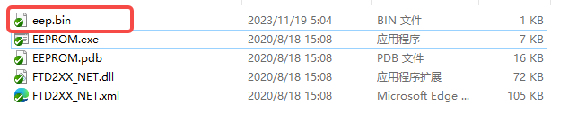
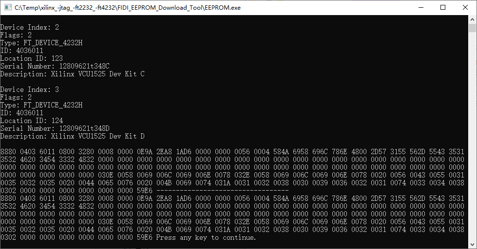

# Xilinx_Jtag_FT2232_FT4232

#### 介绍
FTDI芯片烧写EEPROM工具以及FT2232 FT4232在vivado下可以识别的文件

#### 使用说明

1.  连接自制的FT2232/4232 板子，确保可以在设备管理器中找到对应设备

2.  选择合适的bin文件，将其命名为eep.bin

3.  运行EEPROM.exe，会看到识别到对应芯片并写入数据，上方为源数据（第一次全为0xff），下方为写入数据

#### 链接
1.  EEPROM下载工具来自于：> https://github.com/TerayTech/TT_Digilent_JTAG_HS2
2.  BIN文件来自于：> https://github.com/dragonlock2/ftdi_dumps
3.  自制PCB参考：https://oshwhub.com/zooxyz/xilinx-jtag-ft2232-4232

