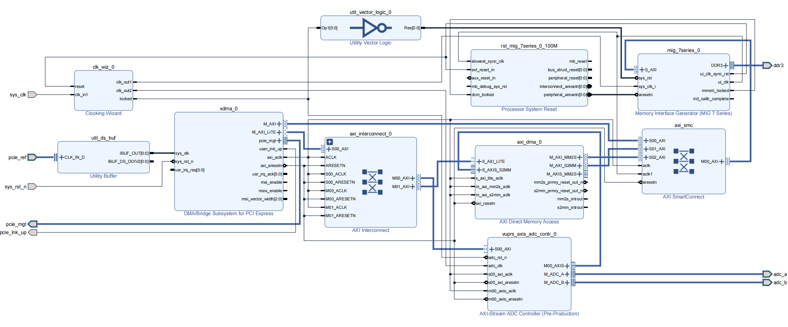
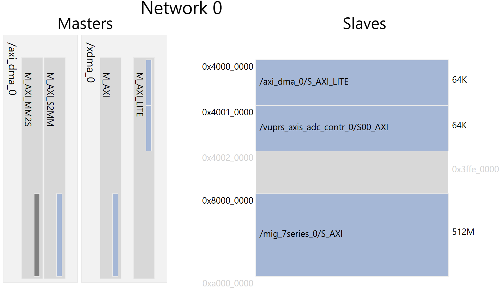

# VUPRS Programming Manual

本文档是高速数据采集板编程指南, 记录了所有编程调试步骤.  

## 1. `FPGA` 侧系统设计与使用

`FPGA` 使用 `PCIe` 接口和 `RK3568` 通信.  
具体的, `FPGA` 通过 `XDMA IP` 将 `PCIe` 事务映射到 `FPGA` 侧 `AXI-Full` 和 `AXI-Lite` 总线.  

    AXI-Full 总线负责 DDR3 的读写, 是主要数据通道

    AXI-Lite 总线负责配置 ADC 采集控制模块和 DMA 控制模块

系统可以完成定频/定帧采样.  

### 1.1 `FPGA` 侧 `Block Design`

按照系统实际需求, `FPGA` 系统框图设计如下, 当前提交的设计已经达到时序收敛.  
  
  
  
### 1.2 `FPGA` 侧 `AXI` 总线地址分配

主机通过 `PCIe` 接口访问 `FPGA` 侧 `AXI-Full` 和 `AXI-Lite` 总线.  
`AXI-Full` 总线可以访问 `DDR3` 的全部数据 (`512 M`); `AXI-Lite` 主要用于控制 `FPGA` 侧的采集和数据传递过程, 可以访问相关寄存器.  
`AXI-Lite` (`BAR` 地址为 `0x4000_0000`) 总线可以访问所有配置寄存器.  
  
`AXI` 总线 (包括 `AXI-Full` 和 `AXI-Lite`) 的有效地址范围为 `0x4000_000 - 0xA000_0000`, 这个范围中每一段地址分配如下:  

| 起始地址 | 结束地址 | 大小 | 用途 |
| :---: | :---: | :---: | :--- |
| `0x0000_0000` | `0x3FFF_FFFF` | `-` | Reserved |
| `0x4000_0000` | `0x4000_FFFF` | `64 k` | `DMA` 模块控制器地址范围 |
| `0x4001_0000` | `0x4001_FFFF` | `64 k` | `ADC` 模块控制器地址范围 |
| `0x4002_0000` | `0x7FFF_FFFF` | `-` | Reserved |
| `0x8000_0000` | `0x9FFF_FFFF` | `512 M` | `DDR3` 地址范围,  `ADC` 采样数据从该地址处读取 |
  
  

### 1.3 通过 `AXI` 总线控制 `FPGA` 完成采集

主机通过 `AXI-Lite` 配置 `DMA` 和 `ADC` 完成数据采集与转移操作, 然后通过 `AXI-Full` 总线将数据从 `FPGA` 侧 `DDR` 转移到 `RK3568` 中.  
正确配置 `DMA` 和 `ADC` 控制寄存器即可完成采集.  
  
#### 1.3.1 `DMA` 控制器配置说明
  
请参考 `Xilinx` 官方文档 `PG021 AXI DMA`, 将 `DMA` 指向 `DDR` 的起始地址并开启 `DMA`.  
  
#### 1.3.2 `ADC` 控制器配置说明
  
 `ADC` 控制器中有 `6` 个控制与状态寄存器, 这些寄存器的信息如下表所示.  
  
| `Address` | `Name` | `R/W` | `Description` |
| :--- | :--- | :--- | :--- |
| `0x00` | `SCI` | `R/W` | Sampling Clock Increment |
| `0x04` | `SP` | `R/W` | Sampling Points |
| `0x08` | `SF` | `R/W` | Sampling Frames |
| `0x0C` | `STR` | `R/W` | Sampling Trigger & Ready |
| `0x10` | `NGF` | `R` | Number of Generated Frames |
| `0x14` | `ERR` | `R` | Error Flags of ADC |
  
**寄存器详细信息**  
  
**`SCI (Sampling Clock Increment, offset = 00h)`**  
  
`ADC` 工作时钟通过外部高精度晶振输入, 在 `FPGA` 中被锁定为 `50 MHz`. `ADC` 采样触发时钟通过工作时钟分频得到, 该寄存器即设置分频系数, 采样频率 $f_{sampling}$ 和 周期 $T_{sampling}$ 与寄存器 `SCI` 取值的关系为:  
  
$$f_{sampling} = \frac{50 \times 10 ^ 6}{2 \times SCI}\ (Hz)$$
$$T_{sampling} = 40 \times SCI\ (ns)$$
  
**`SP (Sampling Points, offset = 04h)`**  
  
该寄存器的值是 `ADC` 在每一帧中的采样点数, 为了便于傅里叶变换等应用, 建议将该值设置为 `2` 的指数幂.  
  
**`SF (Sampling Frames, offset = 08h)`**  
  
该寄存器的值是 `ADC` 的采样帧数目. 结合 `SP` 寄存器的值, 总采样点数 $N_{sampling}$ 通过下式计算:  
  
$$ N_{sampling} = SP \times SF\ (points)$$
  
每个采样点都会产生 `16` 个通道的 `16` 位 `ADC` 数据, 因此 $N_{sampling}$ 对应的数据字节数 $C_{sampling}$ 为:  
  
$$ C_{sampling} = 32 \times N_{total}\ (bytes)$$
  
请确保 `FPGA` 侧的 `DDR` 空间足够, 即:  
  
$$ C_{sampling} \leq 512 MB $$
  
  
**`STR (Sampling Trigger & Ready, offset = 0Ch)`**  
  
**对该寄存器的任何写操作都会触发采样** (这些写操作不会实际作用于寄存器, 但是会被内部触发器捕捉从而触发采样).  
同时该寄存器的 `0` 位用于显示上一个任务是否完成:  

**STR寄存器**
| Bits | Name | Description |
| :---: | :---: | :--- |
| `0` | `RDY` | `0` = 上一次采样正在进行中, 新的配置数据不能写入;  `1` = 上一次采样结束, 可以写入新数据并触发新一轮采样; |
| `[31: 1]` | - | Reserved |
  
**`NGF (Number of Generated Frames, offset = 10h)`**  
  
该寄存器的值表明当前采样帧数, 可以用于监控采样进度.  
  
**`ERR (Error Flags of ADC, offset = 14h)`**  
  
该寄存器的值表明当前遭遇的错误情况, 寄存器的每一段表示不同模块的错误信息:  

**ERR寄存器**
| Bits | Name | Description |
| :---: | :---: | :--- |
| `[3: 0]` | `ADC_A_ERR` | `ADC-A` 的硬件错误代码 |
| `[7: 4]` | `ADC_B_ERR` | `ADC-B` 的硬件错误代码 |
| `8` | `BOF` | `1` = `AXI-Stream` 接口缓冲区溢出错误; `0` = 没有错误. |
| `9` | `ERR_POINTER` | `1` = `AXI-Stream` 接口缓冲区指针错误; `0` = 没有错误 |
| `[31: 10]` | - | Reserved |

`ADC` 硬件错误代码类型如下:  
| Code | Name | Description |
| :---: | :--- | :--- |
| `0000` | No Error | 采样正常 |
| `0001` | Conversion Timeout | 模数转换超时 |
| `0010` | FIRST_DATA Error Status | 引脚 `FIRST_DATA` 电平信号错误: `情况1` 在第 `1` 通道读取时不是高电平; `情况2` 在其他通道读取时不是低电平. |
| `0011` | Internal Registers Error | `ADC` 控制器内部寄存器状态错误, 系统可能受到极强干扰 |
| `0100` | Sampling Timeout | 采样流程整体超时 |
| `0101` | Unable to Start Sampling | 无法开启采样, `ADC` 芯片的 `Busy` 引脚没有自动拉高 |
| `0110` | Sampling Too Fast | 采样频率设置过高, 无法满足定时采集 |

#### 1.3.3 `ADC` 采集流程

对于每一次采样, 请严格按照以下步骤操作 `ADC` 控制器中的寄存器 (在以下所有操作之前, 请确保开启了 `DMA` 转换, 否则数据无法写入 `DDR`):  
  
`Step 1`: (等待上一次采样完成) 读 `STR` 寄存器, 等待 `STR[0]` 被硬件置位;  
`Step 2`: 向 `SCI` 寄存器写入正确的分频系数;  
`Step 3`: 向 `SP` 寄存器写入期望的采样点数;  
`Step 4`: 向 `SF` 寄存器写入期望的采样帧数;  
`Step 5`: 向 `STR` 寄存器写入任意值, 开启采样;  
`Step 6`: (等待本次采样完成) 读 `STR` 寄存器, 等待 `STR[0]` 被硬件置位;  
`Step 7`: 获取 `DDR` 中的数据.  

### 1.4 存储的数据帧格式

`ADC` 数据帧由 `18` 个 `32 bit` 数据组成 (总共 `576 bits`/`144 bytes`/`72 words`), 当存储在 `DDR` 中时, 对于任意有效的, 并且指向一个数据帧开头的 `DDR` 偏移地址 `base`, 数据按字节地址排列为:  

| Number | Address(bytes) | Name | data | Description |
| :---: | :--- | :---: | :--- | :--- |
| `0` | `[base + 3, base]` | `Header` | `0x0000FFF0` | Frame Header |
| --- | --- | --- | --- | --- |
| `1` | `[base + 7, base + 4]` | `D0` | `{ADC_VA1[15: 0], CRC_H, CRC_L}` | ADC Channel A1 & CRC |
| `2` | `[base + 11, base + 8]` | `D1` | `{ADC_VA2[15: 0], CRC_H, CRC_L}` | ADC Channel A2 & CRC |
| `3` | `[base + 15, base + 12]` | `D2` | `{ADC_VA3[15: 0], CRC_H, CRC_L}` | ADC Channel A3 & CRC |
| `4` | `[base + 19, base + 16]` | `D3` | `{ADC_VA4[15: 0], CRC_H, CRC_L}` | ADC Channel A4 & CRC |
| `5` | `[base + 23, base + 20]` | `D4` | `{ADC_VA5[15: 0], CRC_H, CRC_L}` | ADC Channel A5 & CRC |
| `6` | `[base + 27, base + 24]` | `D5` | `{ADC_VA6[15: 0], CRC_H, CRC_L}` | ADC Channel A6 & CRC |
| `7` | `[base + 31, base + 28]` | `D6` | `{ADC_VA7[15: 0], CRC_H, CRC_L}` | ADC Channel A7 & CRC |
| `8` | `[base + 35, base + 32]` | `D7` | `{ADC_VA8[15: 0], CRC_H, CRC_L}` | ADC Channel A8 & CRC |
| --- | --- | --- | --- | --- |
| `9` | `[base + 39, base + 36]` | `D8` | `{ADC_VB1[15: 0], CRC_H, CRC_L}` | ADC Channel B1 & CRC |
| `10` | `[base + 43, base + 40]` | `D9` | `{ADC_VB2[15: 0], CRC_H, CRC_L}` | ADC Channel B2 & CRC |
| `11` | `[base + 47, base + 44]` | `D10` | `{ADC_VB3[15: 0], CRC_H, CRC_L}` | ADC Channel B3 & CRC |
| `12` | `[base + 51, base + 48]` | `D11` | `{ADC_VB4[15: 0], CRC_H, CRC_L}` | ADC Channel B4 & CRC |
| `13` | `[base + 55, base + 52]` | `D12` | `{ADC_VB5[15: 0], CRC_H, CRC_L}` | ADC Channel B5 & CRC |
| `14` | `[base + 59, base + 56]` | `D13` | `{ADC_VB6[15: 0], CRC_H, CRC_L}` | ADC Channel B6 & CRC |
| `15` | `[base + 63, base + 60]` | `D14` | `{ADC_VB7[15: 0], CRC_H, CRC_L}` | ADC Channel B7 & CRC |
| `16` | `[base + 67, base + 64]` | `D15` | `{ADC_VB8[15: 0], CRC_H, CRC_L}` | ADC Channel B8 & CRC |
| --- | --- | --- | --- | --- |
| `17` | `[base + 71, base + 68]` | `Tailer` | `0x0000FF0F` | Frame Tailer |
  
其中 `CRC` 校验使用的多项式为 `CRC8/CDMA2000`:  

    p(x) = 1+x^1+x^3+x^4+x^7+x^8

二进制编码为 `0x9B`. 这里分别对 `ADC` 数据的高 `8` 位和低 `8` 位进行计算:  

    CRC_H = CRC(ADC_V**[15: 8]);
    CRC_L = CRC(ADC_V**[7: 0]);

## 2. 通过 `RK3568` 控制 `FPGA` 侧寄存器

为了使用 `PCIe` 接口, 请在 `RK3568` 设备数中将相关节点 `enable`, 同时将 `Bitstream` 下载到 `FPGA`, 然后挂载 `xdma.ko` 驱动.  
当 `xdma.ko` 驱动成功挂载到操作系统后, 该驱动会申请多个设备文件, 通过读写这些设备文件就能直接访问 `FPGA` 侧的寄存器.  
该驱动会申请 `2` 个 `Host to Card (H2C)` 通道, 用于 `RK3568` 向 `FPGA` `AXI-Full` 总线设备传输数据:  

    /dev/xdma0_h2c_0
    /dev/xdma0_h2c_1

同时, `2` 个 `Card to Host (C2H)` 通道, 用于 `RK3568` 从 `FPGA` `AXI-Full` 总线设备中读取数据:  

    /dev/xdma0_c2h_0
    /dev/xdma0_c2h_1

同时, `1` 个 `Control` 通道, 用于访问 `XDMA-DMA` 寄存器:

    /dev/xdma0_control

同时, `1` 个 `User` 通道, 用于访问 `AXI-Lite` 总线上的寄存器:  

    /dev/xdma0_user

同时, `16` 个中断通道, 用于 `XDMA IP` 向主机发起中断:  

    /dev/xdma_events_0
    /dec/xdma_events_1

    ... ...

    /dev/xdma_events_15

_Shixuan Liu 2025_